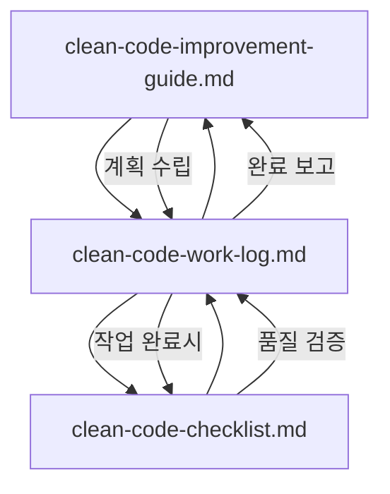

# 개발 가이드 모음

이 폴더는 Matter Certis Crawler 프로젝트의 개발 가이드 문서들을 포함합니다.

## 📚 문서 목록

### 🎯 Clean Code 완성 가이드

#### 1. [Clean Code 개선 가이드](./clean-code-improvement-guide.md)
- **목적**: SW 구조 관점에서 모범적인 설계와 Clean Code 달성
- **내용**: Phase별 개선 계획, 구체적인 구현 방안, 체크리스트
- **대상**: 개발자, 아키텍트
- **사용 시점**: 개선 작업 계획 수립 시

#### 2. [Clean Code 작업 일지](./clean-code-work-log.md)
- **목적**: 개선 작업 진행 상황 추적 및 관리
- **내용**: 진행 상황, 완료된 작업, 이슈 및 주의사항
- **대상**: 프로젝트 관리자, 개발자
- **사용 시점**: 매일 작업 시작/완료 시

#### 3. [Clean Code 품질 체크리스트](./clean-code-checklist.md)
- **목적**: 각 개선 작업 완료 시 코드 품질 검증
- **내용**: Clean Code 원칙, TypeScript, React, MobX 체크포인트
- **대상**: 개발자, 리뷰어
- **사용 시점**: 각 작업 완료 시, 코드 리뷰 시

### 🔗 문서 간 연관관계

### 🚀 사용 워크플로우

1. **계획 단계**
   - `clean-code-improvement-guide.md` 검토
   - Phase별 작업 계획 수립
   - `clean-code-work-log.md`에 계획 반영

2. **개발 단계**
   - 가이드 문서 참조하여 작업 진행
   - 작업 일지에 진행 상황 업데이트
   - 이슈 발생 시 작업 일지에 기록

3. **검증 단계**
   - `clean-code-checklist.md`로 품질 검증
   - 모든 체크포인트 통과 확인
   - 작업 일지에 완료 상태 업데이트

4. **완료 단계**
   - 다음 작업 계획 수립
   - 전체 진행 상황 업데이트

### 🎯 추가 참고 문서

#### 아키텍처 관련
- [../architecture/](../architecture/) - 전체 아키텍처 문서
- [../development/ElectronIPCManual.md](../development/ElectronIPCManual.md) - IPC 통신 가이드

#### 리팩토링 관련
- [../refactoring/](../refactoring/) - 이전 리팩토링 기록

#### 요구사항 관련
- [../requirements/](../requirements/) - 프로젝트 요구사항

### 🏷️ 문서 버전 관리

- **현재 버전**: 1.0
- **마지막 업데이트**: 2025년 6월 2일
- **다음 업데이트**: Phase 1 완료 시

### 📝 문서 작성 규칙

1. **일관성**: 모든 문서는 동일한 마크다운 스타일 사용
2. **추적성**: 변경 사항은 반드시 작업 일지에 기록
3. **업데이트**: 정기적으로 문서 내용 최신화
4. **접근성**: 기술적 배경이 다른 사람도 이해할 수 있도록 작성

---

**문서 관리자**: Clean Code 개선 팀  
**연락처**: 프로젝트 내부 채널  
**마지막 업데이트**: 2025년 6월 2일
